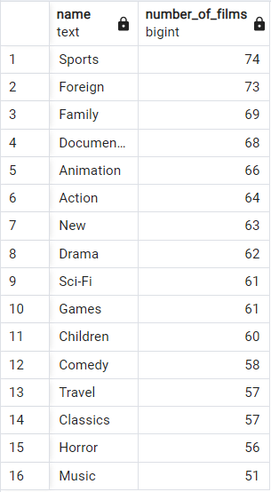
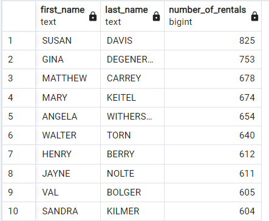
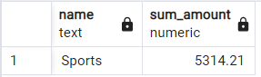
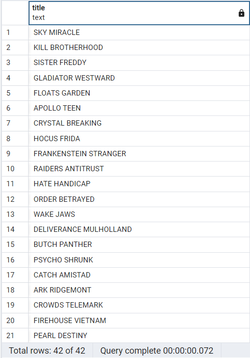
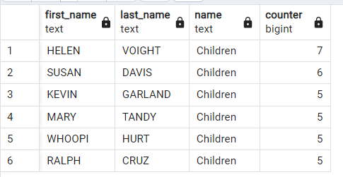
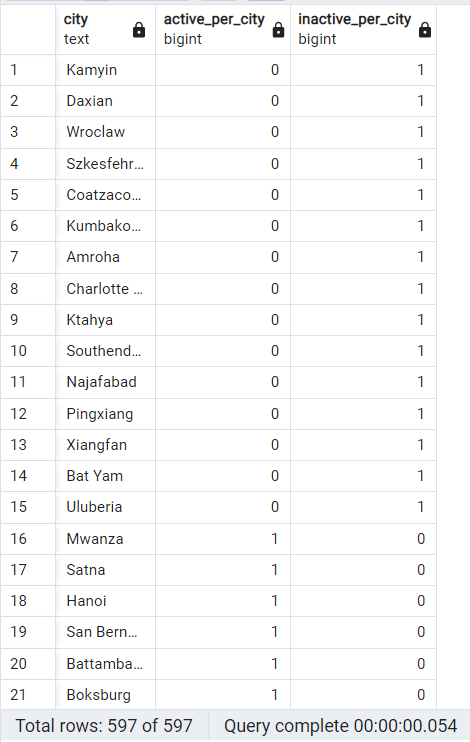
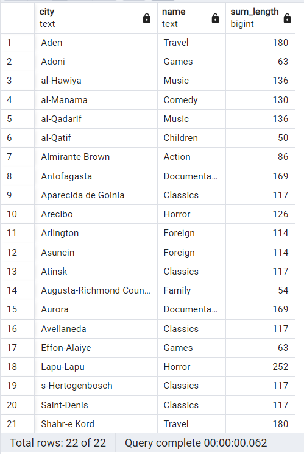

# Task 3. SQL

### 1. Вывести количество фильмов в каждой категории, отсортировать по убыванию.
```postgresql
SELECT category.name, 
       count(*) AS number_of_films
FROM film
INNER JOIN film_category
ON film_category.film_id = film.film_id
INNER JOIN category
ON film_category.category_id = category.category_id
GROUP BY category.name
ORDER BY number_of_films DESC;
```

### 2. Вывести 10 актеров, чьи фильмы большего всего арендовали, отсортировать по убыванию.
```postgresql
SELECT actor.first_name, 
       actor.last_name, 
       count(*) AS number_of_rentals
FROM rental
INNER JOIN inventory
ON rental.inventory_id = inventory.inventory_id
INNER JOIN film
ON inventory.film_id = film.film_id
INNER JOIN film_actor
ON film.film_id = film_actor.film_id
INNER JOIN actor
ON film_actor.actor_id = actor.actor_id
GROUP BY actor.first_name, actor.last_name
ORDER BY number_of_rentals DESC
LIMIT 10;
```

### 3. Вывести категорию фильмов, на которую потратили больше всего денег.
```postgresql
SELECT category.name,
       SUM(payment.amount) AS sum_amount
FROM payment
INNER JOIN rental 
ON payment.rental_id = rental.rental_id
INNER JOIN inventory
ON rental.inventory_id = inventory.inventory_id 
INNER JOIN film
ON inventory.film_id = film.film_id
INNER JOIN film_category
ON film.film_id = film_category.film_id
INNER JOIN category
ON film_category.category_id = category.category_id
GROUP BY category.name
ORDER BY sum_amount DESC
LIMIT 1;
```
Вторая версия
```postgresql
SELECT *
FROM sales_by_film_category
LIMIT 1;
```

### 4. Вывести названия фильмов, которых нет в inventory. Написать запрос без использования оператора IN.
```postgresql
SELECT title 
FROM film 
LEFT JOIN inventory 
ON film.film_id = inventory.film_id
WHERE inventory_id IS NULL;
```

### 5. Вывести топ 3 актеров, которые больше всего появлялись в фильмах в категории “Children”. Если у нескольких актеров одинаковое кол-во фильмов, вывести всех.
```postgresql
SELECT first_name, last_name, name, counter
FROM
    (SELECT actor.first_name, actor.last_name,  category.name, count(*) AS counter,
     DENSE_RANK() OVER(ORDER BY count(*) desc) AS rank
     FROM actor
     INNER JOIN film_actor
     ON film_actor.actor_id = actor.actor_id
     INNER JOIN film
     ON film_actor.film_id = film.film_id
     INNER JOIN film_category
     ON film.film_id = film_category.film_id
     INNER JOIN category
     ON film_category.category_id = category.category_id
     WHERE category.name = 'Children'
     GROUP BY actor.first_name, actor.last_name, category.name
    ) AS rs
WHERE rank <= 3;
```

### 6. Вывести города с количеством активных и неактивных клиентов (активный — customer.active = 1). Отсортировать по количеству неактивных клиентов по убыванию.
```postgresql
SELECT city, 
       count(case active when 1 then 1 else null end) as active_per_city,
       count(case active when 0 then 1 else null end) as inactive_per_city
FROM address
INNER JOIN customer
ON customer.address_id = address.address_id
INNER JOIN city
ON city.city_id = address.city_id
GROUP BY city
ORDER BY inactive_per_city DESC;
```

### 7. Вывести категорию фильмов, у которой самое большое кол-во часов суммарной аренды в городах (customer.address_id в этом city), и которые начинаются на букву “a”. То же самое сделать для городов в которых есть символ “-”. Написать все в одном запросе.
```postgresql
SELECT city, 
       name,
       sum_length
FROM
    (SELECT city, 
            name, 
            SUM(length) as sum_length, 
            RANK() OVER (PARTITION BY city  ORDER BY SUM(length) DESC) as rank
     FROM rental
     INNER JOIN customer
     ON rental.customer_id = customer.customer_id
     INNER JOIN address
     ON customer.address_id = address.address_id
     INNER JOIN city
     ON address.city_id = city.city_id
     INNER JOIN inventory
     ON rental.inventory_id = inventory.inventory_id
     INNER JOIN film
     ON inventory.film_id = film.film_id
     INNER JOIN film_category
     ON film.film_id = film_category.film_id
     INNER JOIN category
     ON film_category.film_id = category.category_id
     GROUP BY city, name
     HAVING city LIKE 'A%'
     OR city LIKE 'a%'
     OR city LIKE '%-%'
    ) AS rs
WHERE rank = 1
ORDER BY city;
```
